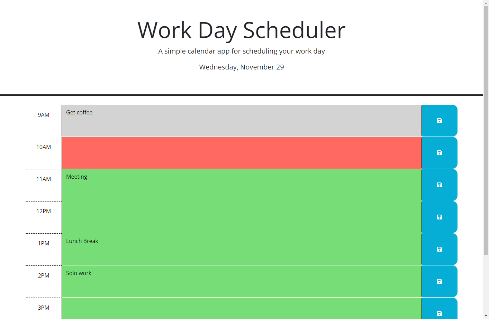

# Work Day Scheduler Challenge

## Description

This project is a day planner for a single day. It shows the current day, shows all the hour blocks from 9AM-5PM, shows if those blocks are in the past, present, or future, and lets the user write and save comments for each block. The project uses DayJS, Bootstrap, local storage, and DOM traversal through JQuery to function.

## Installation

The pertinent files for the project, including this README can all be found in the Github repository located at: https://github.com/mhalder4/work-day-scheduler-challenge. The website can be found at the Github pages address that follows: https://mhalder4.github.io/work-day-scheduler-challenge/.

## Usage

The website has the current date displayed at the top and a short description of the page. There are section for each hour from 9AM to 5PM. Within these sections is a text box that can be edited so the user can plan out their day. Once the user has addded or removed text, they can click the save button to the right of the text area to save the text changes to local storage so any changes made will remain upon reloading the page.

An image of how the completed web page may look at 10AM.

## Credits

N/A

## License

MIT License

Copyright (c) 2023 Matthew Halder

Permission is hereby granted, free of charge, to any person obtaining a copy
of this software and associated documentation files (the "Software"), to deal
in the Software without restriction, including without limitation the rights
to use, copy, modify, merge, publish, distribute, sublicense, and/or sell
copies of the Software, and to permit persons to whom the Software is
furnished to do so, subject to the following conditions:

The above copyright notice and this permission notice shall be included in all
copies or substantial portions of the Software.

THE SOFTWARE IS PROVIDED "AS IS", WITHOUT WARRANTY OF ANY KIND, EXPRESS OR
IMPLIED, INCLUDING BUT NOT LIMITED TO THE WARRANTIES OF MERCHANTABILITY,
FITNESS FOR A PARTICULAR PURPOSE AND NONINFRINGEMENT. IN NO EVENT SHALL THE
AUTHORS OR COPYRIGHT HOLDERS BE LIABLE FOR ANY CLAIM, DAMAGES OR OTHER
LIABILITY, WHETHER IN AN ACTION OF CONTRACT, TORT OR OTHERWISE, ARISING FROM,
OUT OF OR IN CONNECTION WITH THE SOFTWARE OR THE USE OR OTHER DEALINGS IN THE
SOFTWARE.